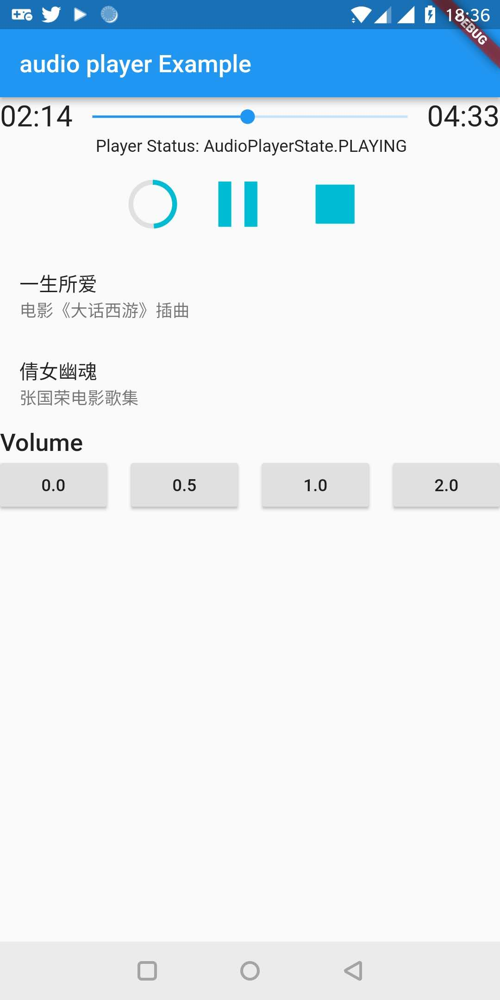

# AudioPlayer

A Flutter plugin to play audio files, currently works for ***Android only***!!!.

 

## Install

This was orginally forked from [luanpotter's audioplayers](https://github.com/luanpotter/audioplayers);

## Usage

An `AudioPlayer` instance can play a single audio at a time. To create it, simply call the constructor:

```dart
    AudioPlayer audioPlayer = new AudioPlayer();
```

For all methods that return a `Future<int>`: that's the status of the operation. If `1`, the operation was successful. Otherwise it's the platform native error code.

Logs are disable by default! To debug, run:

```dart
  AudioPlayer.logEnabled = true;
```


## Supported Formats

You can check a list of supported formats below:

 - [Android](https://developer.android.com/guide/topics/media/media-formats.html)
 - [iOS](http://www.techotopia.com/index.php/Playing_Audio_on_iOS_8_using_AVAudioPlayer#Supported_Audio_Formats)

## :warning: iOS App Transport Security

By default iOS forbids loading from non-https url. To cancel this restriction you must edit your `.plist` and add:

```xml
<key>NSAppTransportSecurity</key>
<dict>
    <key>NSAllowsArbitraryLoads</key>
    <true/>
</dict>
```

## Credits

This was originally a fork of [rxlabz's audioplayer](https://github.com/rxlabz/audioplayer)/[luanpotter's audioplayers](https://github.com/luanpotter/audioplayers).